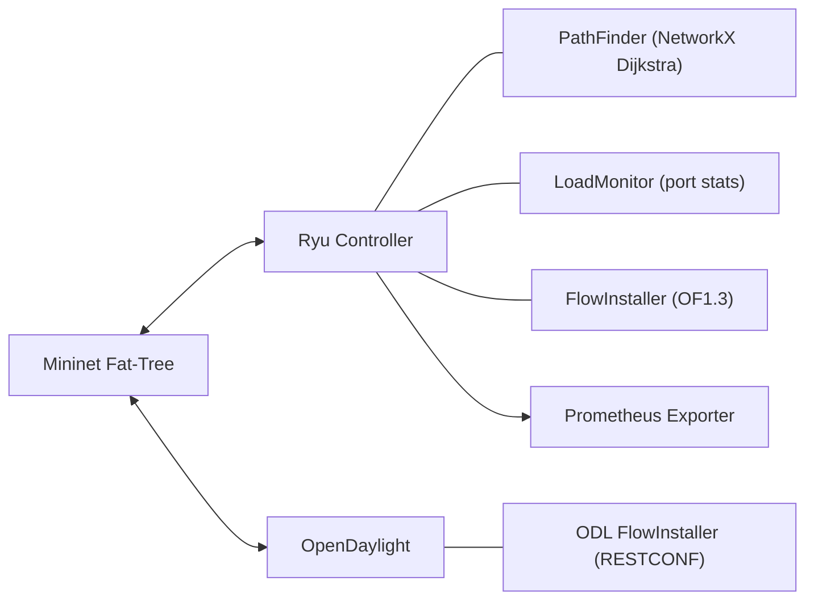

# SDN Multipath Load Balancer for Fat-Tree Topologies (2025)

A modern, containerized SDN project that combines equal-cost multipath (ECMP) routing with dynamic load balancing for fat-tree data center fabrics. Uses Dijkstra (via NetworkX) to find all hop-count shortest paths and balances traffic across them using weighted round-robin based on live link utilization. Supports Ryu (Python) and OpenDaylight (Titanium, 2025).

## Features
- Multipath ECMP based on hop-count shortest paths (latency-aware)
- Dynamic load-aware balancing (weighted by link TX/RX utilization)
- Ryu controller app with OpenFlow 1.3 flow programming
- OpenDaylight RESTCONF client with proactive flow installation
- Mininet fat-tree topology (default k=4), customizable
- Prometheus metrics exporter and Grafana-ready
- Docker Compose environment (Mininet, Ryu, ODL, Prometheus)
- Python 3.13+, NetworkX, pytest tests for logic

## Architecture


## Quick Start (Docker Compose)
- Requirements: Docker 24+, Docker Compose v2, Linux with nested networking enabled. For Mininet-in-Docker, root/privileged is required.

```bash
# Build and start core services
docker compose up -d --build ryu odllb prometheus grafana

# Start Mininet fat-tree in a separate terminal (requires privileged)
docker compose up mininet
```

- Ryu Prometheus metrics: http://localhost:8000/metrics
- ODL RESTCONF: https://localhost:8443/restconf (default creds: admin/admin; dev only)

## Local Dev (Poetry)
```bash
poetry install
poetry run pytest -q
```

## Repo Layout
- `main.py`: Entrypoint helper for local dev
- `controllers/ryu_app.py`: Ryu application
- `controllers/odl_client.py`: OpenDaylight RESTCONF client
- `utils/`: PathFinder, LoadMonitor, FlowInstaller, TopologyManager, hashing utils
- `mininet/fat_tree.py`: Fat-tree topology and runner
- `tests/`: Unit tests for path and selection logic
- `docs/`: Architecture and design notes

## Notes
- Python 3.13 support depends on `ryu` and `eventlet` compatibility on your platform. If issues occur, use Python 3.12 for the Ryu service while keeping 3.13 for tooling/tests.
- OpenDaylight container references the Titanium GA release (2025-08-11). See `docker-compose.yml` for details.

## License
MIT — see `LICENSE`.
